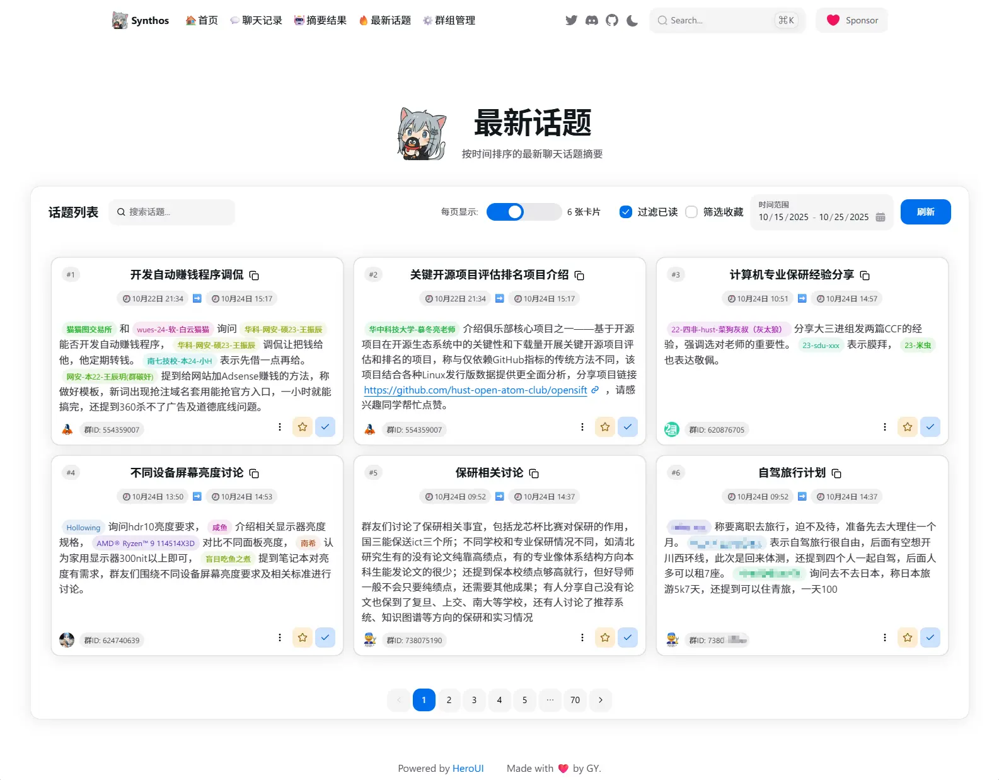
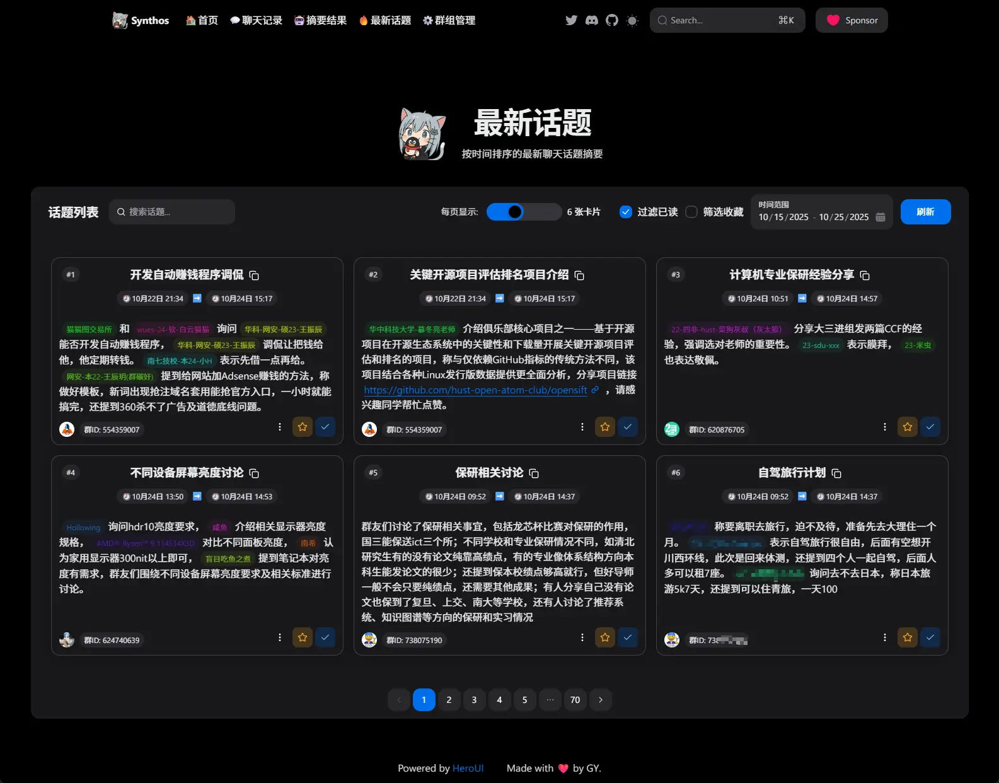

## 界面展示

亮色模式：



暗黑模式：



细节：


## 系统架构


## TODO任务单

- 转发聊天记录跟随
- 引用聊天记录跟随
- 自动拉取历史聊天记录
- 每天生成日报
- 兴趣度指数：用户给出自己的兴趣偏好（关键词标签组），系统根据用户的兴趣偏好为每个话题打分，排序后推荐给用户。（用户也可以标记不喜欢的话题，此时话题得分为负数）

## 快速开始

由于需要在本地跑BGE向量模型，建议电脑内存至少16GB。

使用monorepo管理项目，pnpm管理依赖，vitest进行单测。

重要：首先需要在项目根目录下面放好配置文件 `synthos_config.json`，配置文件的填写格式请自己参考源码中的相应类型声明。

重要：此外，项目使用agenda进行任务编排和调度，底层依赖于MongoDB，需要提前下载安装好：[https://www.mongodb.com/try/download/community](https://www.mongodb.com/try/download/community)

重要：文本向量化依赖bge-large-zh-v1.5这个模型，本地跑CPU上。需要在这里下载： [https://huggingface.co/Xenova/bge-large-zh-v1.5/resolve/main/onnx/model.onnx](https://huggingface.co/Xenova/bge-large-zh-v1.5/resolve/main/onnx/model.onnx)
huggingface速度较慢，建议使用多线程下载器。下载完成后放在 `根目录\node_modules\.pnpm\@huggingface+transformers@3.7.6\node_modules\@huggingface\transformers\.cache\Xenova\bge-large-zh-v1.5\onnx`

1. 根目录安装依赖

```bash
pnpm i
```

2. 进入子项目目录

```bash
cd apps/data-provider
```

3. 安装子项目依赖

```bash
pnpm i
```

4. 启动子项目

```bash
npm run build && cd dist && node index
```
