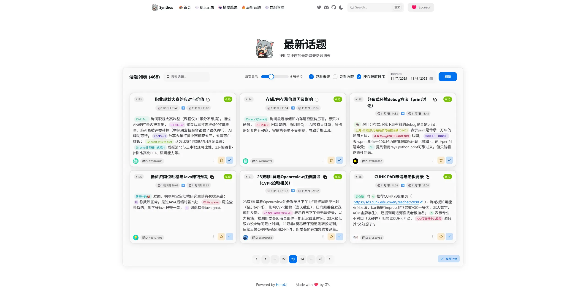
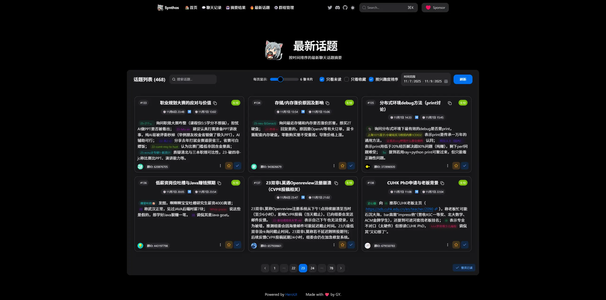
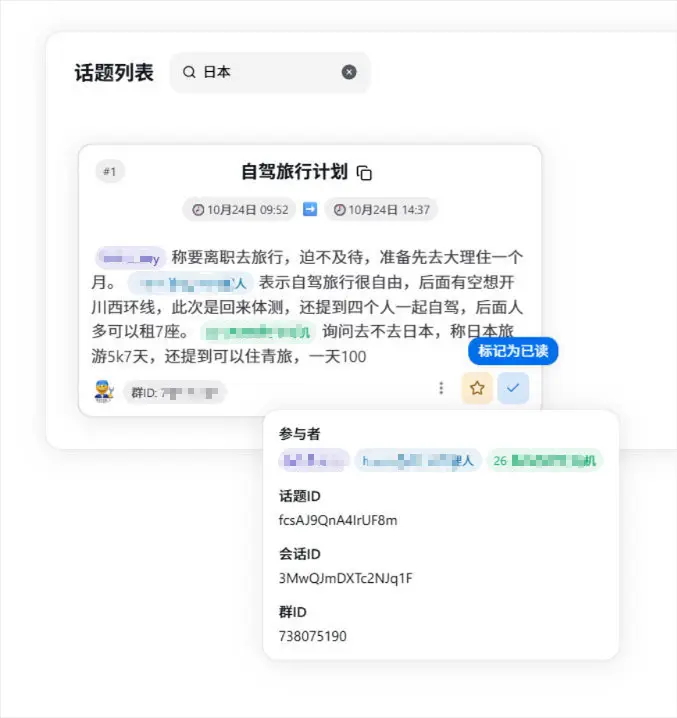
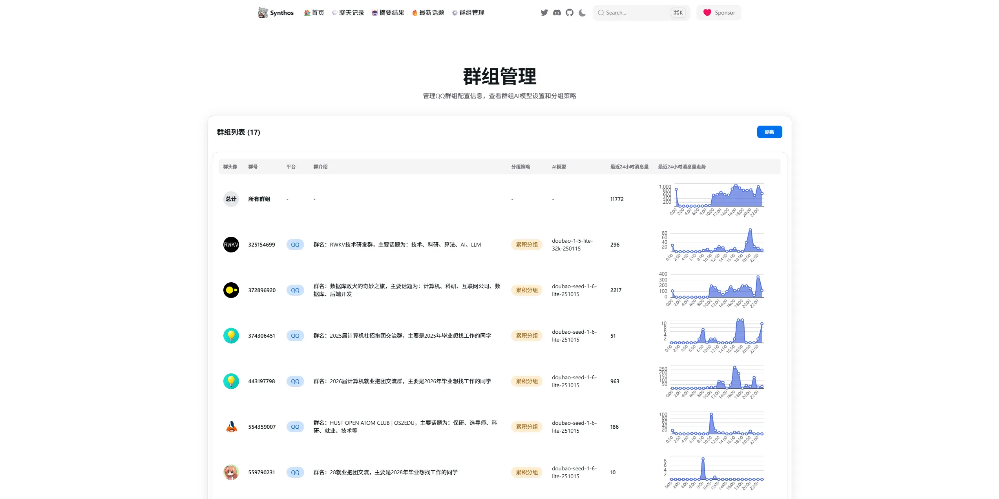
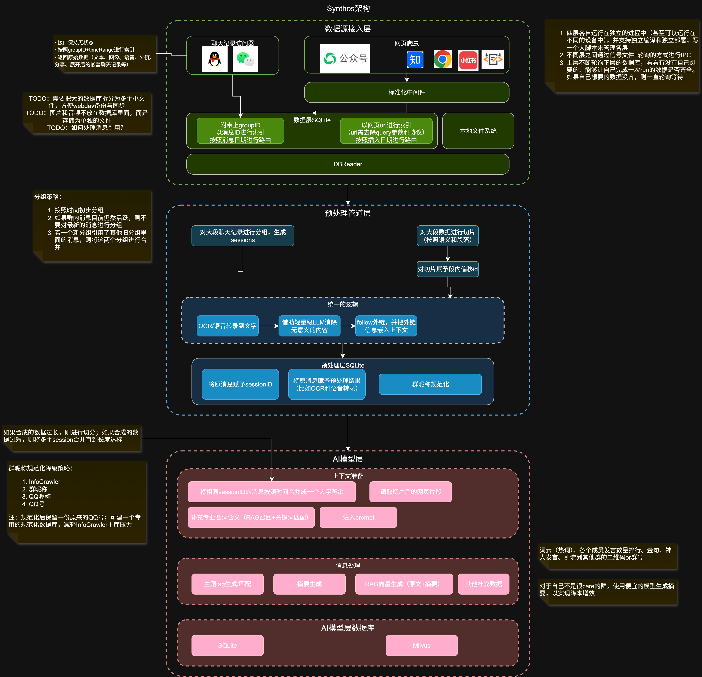
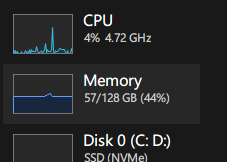

# Synthos：智能聊天记录全链路分析系统

## 项目简介

Synthos 是一个基于 `Node.js` 和 `TypeScript` 构建的智能聊天记录分析系统，专注于 QQ 聊天记录的全链路数据处理与 AI 总结功能。项目采用现代化的 monorepo 架构，融合自然语言处理、向量模型、任务调度与 Web 前端展示，为用户提供从原始聊天记录导入、上下文理解、兴趣度分析到可视化摘要输出的一站式解决方案。

无论是个人用户希望回顾重要对话，还是团队管理者需要洞察群聊趋势，Synthos 都能通过 AI 赋能，让海量聊天信息变得可读、可查、可理解。

---

## 界面展示

亮色模式：  


暗黑模式：  


细节交互：  


群组管理界面：  


---

## 系统架构



---

## 核心功能特性

- **智能预处理**：自动分组、上下文拼接、引用消息追踪
- **AI 摘要生成**：基于 云端/本地 模型生成高质量对话摘要
- **兴趣度指数**：用户可设置关键词偏好，系统为每个话题打分排序（支持负向反馈）
- **历史记录自动拉取**：支持增量同步与历史回溯
- **日报自动生成**：每日汇总高价值讨论内容
- **多群组管理**：灵活配置不同群组的分析策略

> **TODO愿望单**  
>
> - [WIP] 转发聊天记录跟随  
> - ✅ 已完成 引用聊天记录跟随  
> - [WIP] 主动拉取历史聊天记录（⚠️目前技术实现遇到困难）
> - [WIP] 每天生成日报  
> - ✅ 已完成 兴趣度指数：用户给出自己的兴趣偏好（关键词标签组），系统根据用户的兴趣偏好为每个话题打分，排序后推荐给用户。（用户也可以标记不喜欢的话题，此时话题得分为负数）

---

## 技术架构

### 核心技术栈

- **🧑‍💻语言**：TypeScript + Node.js（未来可能引入 Python + grpc 🤔?）
- **🎯项目管理**：Pnpm + Monorepo  
- **📚数据库**：MongoDB（任务调度） + SQLite（聊天记录 & ai生成数据存储） + LevelDB（KV元数据存储）
- **🧐向量语义模型**：`bge-large-zh-v1.5`（本地 ONNX 向量化），用于兴趣打分和 RAG
- **🤖LLM框架**：Langchain，支持任意云端 LLM or 本地的 Ollama
- **🕗任务调度与编排框架**：Agenda.js  
- **🧪单元测试框架**：Vitest  
- **🌏Web 后端框架**：Express.js
- **⚛️Web 前端框架**：React + ECharts + HeroUI

### 模块划分

| 模块 | 职责 |
|------|------|
| `data-provider` | 从 QQ 等 IM 平台获取原始聊天记录 |
| `preprocessing` | 清洗、分组、上下文拼接、引用解析 |
| `ai-model` | 文本向量化、主题提取、摘要生成、兴趣度计算 |
| `webui-backend` | 提供 RESTful API，支持群组管理、消息查询、结果获取 |
| `common` | 共享类型定义、配置管理、数据库工具、日志系统 |

---

## 快速开始

> ⚠️ **硬件要求**  
>
> - 由于需在本地运行 BGE 向量模型（峰值内存占用约 11GB），加上 MongoDB、Node 进程和 SQLite 实例，**建议内存 ≥16GB，推荐 32GB 或 64GB**。
> - CPU 随意。
> - 够用的硬盘空间。



### 1. 环境准备

#### 安装 MongoDB

项目依赖 Agenda 进行任务调度，需提前安装 [MongoDB 社区版](https://www.mongodb.com/try/download/community) 并确保服务正在运行。

#### 下载 BGE 向量模型

下载 `bge-large-zh-v1.5` 的 ONNX 格式模型：

```bash
# huggingface即使开了梯子也巨慢，推荐镜像站 or 使用多线程下载器加速
https://huggingface.co/Xenova/bge-large-zh-v1.5/resolve/main/onnx/model.onnx
```

下载后放置到以下路径：

```
根目录/node_modules/.pnpm/@huggingface+transformers@3.7.6/node_modules/@huggingface/transformers/.cache/Xenova/bge-large-zh-v1.5/onnx/
```

#### 准备配置文件

在项目根目录创建 `synthos_config.json`，格式请参考 [`./common/config/@types/GlobalConfig.ts`](d:\FR_Projects\synthos\common\config\@types\GlobalConfig.ts)。  
QQ 数据库密钥配置方法详见：[https://docs.aaqwq.top/](https://docs.aaqwq.top/)

> 💡 **运维建议**：数据无价，项目运行中产生的 SQLite 和 LevelDB 数据库建议定期执行“3-2-1”备份策略（3份副本、2种介质、1份异地），防止数据丢失。

### 2. 启动项目

```bash
# 1. 根目录安装主依赖
pnpm i

# 2. 进入 data-provider 子项目并安装依赖
cd apps/data-provider
pnpm i

# 3. 返回根目录，启动所有服务
cd ../..
npm run dev
```

服务启动后，可通过以下方式验证：

- WebUI 后端：`http://localhost:3002`
- 健康检查接口：`GET /health`

---

## API 与前端开发

- **API 文档**：详见 [`apps/webui-backend/docs/API文档.md`](d:\FR_Projects\synthos\apps\webui-backend\docs\API文档.md)
- **前端开发指引**：详见 [`apps/webui-backend/docs/前端开发指引文档.md`](d:\FR_Projects\synthos\apps\webui-backend\docs/前端开发指引文档.md)

核心接口包括：

- `GET /api/group-details`：获取群组列表
- `GET /api/chat-messages-by-group-id`：按群组查询消息
- `GET /api/ai-digest-result-by-topic-id`：获取 AI 摘要结果
- `GET /api/is-session-summarized`：检查会话是否已总结

---
