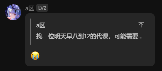
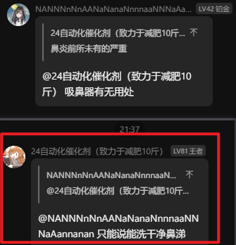

## 1. 嵌套消息（又称引用/提及）的结构

对于下面的图片所示消息:



其pb直接转为utf8字符串为：

```
�����u_2F9cgITHgkC0Yo32nIht9w��˓��Ň��h��В�ؒㅷ������������ǜ������ӓ��Ň��h��^��̓��Ň��h���J找一位明天早八到12的代课，可能需要帮忙找老师问点事����ѓ��Ň��h���😭��
```

其pb按照 `messageSegment.proto` 解码后的js对象结构如下：

```js
[
    {
        senderId: "u_2F9cgITHgkC0Yo32nIht9w",
        receiverId: "",
        messageId: "7559956338863016395",
        messageType: 7,
        messageText: "",
        fileName: "",
        filePath: "",
        fileSize: "0",
        file10MMD5: "",
        fileSha: "",
        fileSha3: "",
        videotime: 0,
        picWidth: 0,
        picHeight: 0,
        thumbWidth: 0,
        thumbHeight: 0,
        thumbSizeVideo: 0,
        picType: 0,
        thumbfilename: "",
        originImageMd5: "",
        fileUuid: "",
        imageUrlLow: "",
        imageUrlHigh: "",
        imageUrlOrigin: "",
        imageText: "",
        thumbMD5: "",
        duration: 0,
        pttText: "",
        waveAmplitudes: "",
        picThumbPath: "",
        replyMsgId: "0", // 引用的消息的messageId, 似乎始终为0，原因未知
        replyMsgSeq: 18672,
        replyMsgTime: 1741538019,
        receiverUid: 0,
        replyMsgContent: "",
        replySenderNick: "",
        replyMessage: {
            senderId: "",
            receiverId: "",
            messageId: "7559956338863016396",
            messageType: 1,
            messageText: "找一位明天早八到12的代课，可能需要帮忙找老师问点事",
            fileName: "",
            filePath: "",
            fileSize: "0",
            file10MMD5: "",
            fileSha: "",
            fileSha3: "",
            videotime: 0,
            picWidth: 0,
            picHeight: 0,
            thumbWidth: 0,
            thumbHeight: 0,
            thumbSizeVideo: 0,
            picType: 0,
            thumbfilename: "",
            originImageMd5: "",
            fileUuid: "",
            imageUrlLow: "",
            imageUrlHigh: "",
            imageUrlOrigin: "",
            imageText: "",
            thumbMD5: "",
            duration: 0,
            pttText: "",
            waveAmplitudes: "",
            picThumbPath: "",
            replyMsgId: "0",
            replyMsgSeq: 0,
            replyMsgTime: 0,
            receiverUid: 0,
            replyMsgContent: "",
            replySenderNick: "",
            replyMessage: null,
            emojiId: 0,
            emojiText: "",
            withdrawSuffix: "",
            applicationMessage: "",
            callStatusText: "",
            callText: "",
            feedTitle: null,
            feedContent: null,
            feedUrl: "",
            feedLogoUrl: "",
            feedPublisherUid: 0,
            feedJumpInfo: "",
            feedPublisherId: "",
            noticeInfo: "",
            noticeInfo2: "",
            xmlMessage: "",
            sendTimestamp: 0,
            thumbSize: 0
        },
        emojiId: 0,
        emojiText: "",
        withdrawSuffix: "",
        applicationMessage: "",
        callStatusText: "",
        callText: "",
        feedTitle: null,
        feedContent: null,
        feedUrl: "",
        feedLogoUrl: "",
        feedPublisherUid: 0,
        feedJumpInfo: "",
        feedPublisherId: "",
        noticeInfo: "",
        noticeInfo2: "",
        xmlMessage: "",
        sendTimestamp: 0,
        thumbSize: 0
    },
    {
        senderId: "",
        receiverId: "",
        messageId: "7559956338863016401",
        messageType: 1,
        messageText: "😭",
        fileName: "",
        filePath: "",
        fileSize: "0",
        file10MMD5: "",
        fileSha: "",
        fileSha3: "",
        videotime: 0,
        picWidth: 0,
        picHeight: 0,
        thumbWidth: 0,
        thumbHeight: 0,
        thumbSizeVideo: 0,
        picType: 0,
        thumbfilename: "",
        originImageMd5: "",
        fileUuid: "",
        imageUrlLow: "",
        imageUrlHigh: "",
        imageUrlOrigin: "",
        imageText: "",
        thumbMD5: "",
        duration: 0,
        pttText: "",
        waveAmplitudes: "",
        picThumbPath: "",
        replyMsgId: "0",
        replyMsgSeq: 0,
        replyMsgTime: 0,
        receiverUid: 0,
        replyMsgContent: "",
        replySenderNick: "",
        replyMessage: null,
        emojiId: 0,
        emojiText: "",
        withdrawSuffix: "",
        applicationMessage: "",
        callStatusText: "",
        callText: "",
        feedTitle: null,
        feedContent: null,
        feedUrl: "",
        feedLogoUrl: "",
        feedPublisherUid: 0,
        feedJumpInfo: "",
        feedPublisherId: "",
        noticeInfo: "",
        noticeInfo2: "",
        xmlMessage: "",
        sendTimestamp: 0,
        thumbSize: 0
    }
];
```

这是一个典型的两段式结构，第一段是messageType为7的引用（引用了一条先前发送的消息），第二段是messageType为1的文本消息正文。

## 2. at消息的结构



下面的js已经去除了一些冗余字段，便于展示。

```js
[
    // 引用
    {
        senderId: "u_UYvwXOkWFBLmrK9vCpIZdQ",
        receiverId: "",
        messageId: "7559957795182421197",
        messageType: 7,
        messageText: "",    
        replyMsgSeq: 960450,
        replyMsgTime: 3880599217,
        receiverUid: 0,
        replyMsgContent: "",
        replySenderNick: "",
        replyMessage: {
            senderId: "",
            receiverId: "",
            messageId: "7559957795182421199",
            messageType: 1,
            messageText: " 吸鼻器有无用处",
            replyMsgId: "0",
            replyMsgSeq: 0,
            replyMsgTime: 0,
            receiverUid: 0,
            replyMsgContent: "",
            replySenderNick: "",
            replyMessage: null,
        },
    },
    // @其他用户的文本片段
    {
        senderId: "",
        receiverId: "",
        messageId: "7559957795182421204",
        messageType: 1,
        messageText: "@NANNNnNnAANaNanaNnnnaaNNNaAannanan",
        replyMsgId: "0",
        replyMsgSeq: 0,
        replyMsgTime: 0,
        receiverUid: 0,
        replyMsgContent: "",
        replySenderNick: "",
        replyMessage: null,
    },
    // @片段与正文之间有一个空格
    {
        senderId: "",
        receiverId: "",
        messageId: "7559957795182421205",
        messageType: 1,
        messageText: " ",
        replyMsgId: "0",
        replyMsgSeq: 0,
        replyMsgTime: 0,
        receiverUid: 0,
        replyMsgContent: "",
        replySenderNick: "",
        replyMessage: null,
    },
    // 正文
    {
        senderId: "",
        receiverId: "",
        messageId: "7559957795182421206",
        messageType: 1,
        messageText: "只能说能洗干净鼻涕",
        replyMsgId: "0",
        replyMsgSeq: 0,
        replyMsgTime: 0,
        receiverUid: 0,
        replyMsgContent: "",
        replySenderNick: "",
        replyMessage: null,
    }
];
```
